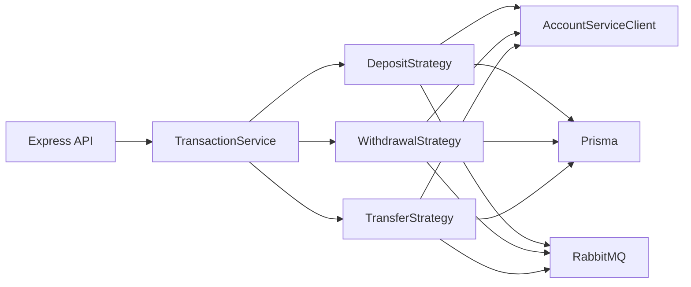

# Banking Transaction Service

This service records and orchestrates ledger transactions (deposits, withdrawals, transfers), enforces transfer idempotency and daily outbound transfer limits, integrates with the Account Service for balance mutations, and publishes `txn.created` events to RabbitMQ.

## Context

- **Runtime:** Node.js 20
- **Framework:** Express 4 with TypeScript (strict)
- **Data:** PostgreSQL 16 via Prisma ORM
- **Observability:** Pino (JSON logs), Prometheus (`/metrics`)
- **Messaging:** RabbitMQ (topic exchange `banking.events`, routing key `txn.created`)

## Prerequisites

- Node.js 20 or newer
- PostgreSQL 16 reachable from the service
- Account Service exposing `POST /internal/accounts/{id}/validate`, `debit`, and `credit`
- RabbitMQ (optional for local development; the process starts if the broker is unavailable, but events are not delivered)

## Quick Start

1. Copy environment template and adjust values:

```bash
cp .env.example .env
```

2. Install dependencies and generate the Prisma client:

```bash
npm install
npx prisma generate
```

3. Apply database migrations (requires a running database and valid `DATABASE_URL`):

```bash
npx prisma migrate deploy
```

4. Seed transactions from the shared CSV dataset (path resolves to `../bank_Dataset/bank_transactions.csv` relative to the `prisma` directory):

```bash
npm run seed
```

5. Run the API:

```bash
npm run dev
```

The HTTP server listens on `PORT` (default `8003`). OpenAPI UI is at `/api/docs`.

## Configuration

Use `.env.example` as the single reference for variables. Do not commit real credentials.

| Variable | Purpose |
|----------|---------|
| `DATABASE_URL` | PostgreSQL connection string for `transaction_db` |
| `ACCOUNT_SERVICE_URL` | Base URL of the Account Service |
| `CUSTOMER_SERVICE_URL` | Base URL of the Customer Service (contact enrichment for `txn.created` events) |
| `RABBITMQ_URL` | AMQP connection string |
| `PORT` | HTTP listen port |
| `LOG_LEVEL` | Pino log level |
| `DAILY_TRANSFER_LIMIT` | Maximum sum of `TRANSFER_OUT` per source account per UTC day (INR) |
| `HIGH_VALUE_THRESHOLD` | Amount above which an informational audit log line is emitted |
| `SERVICE_VERSION` | Reported on `/health` (defaults to `1.0.0`) |

## Architecture

Clients call the presentation layer (Express routes with Zod validation). Application services apply business rules and delegate to strategies (deposit, withdrawal, transfer). Infrastructure implements Prisma repositories, the Account Service HTTP client (Axios, 5s timeout, exponential backoff retries at 1s, 2s, 4s for transient failures), and RabbitMQ publishing.



## API Summary

| Method | Path | Description |
|--------|------|-------------|
| POST | `/api/v1/transactions/deposit` | Credit account, persist `DEPOSIT` |
| POST | `/api/v1/transactions/withdrawal` | Validate, debit, persist `WITHDRAWAL` |
| POST | `/api/v1/transactions/transfer` | Idempotent transfer; requires `Idempotency-Key` header |
| GET | `/api/v1/transactions` | Paginated list (`limit`, `offset`) |
| GET | `/api/v1/transactions/:id` | Fetch by `txn_id` |
| GET | `/api/v1/accounts/:accountId/statements` | Statement for `from_date` / `to_date` (ISO 8601 with offset) |
| GET | `/health` | Liveness/readiness payload |
| GET | `/metrics` | Prometheus scrape endpoint |

Errors use RFC 7807 problem JSON (`type`, `title`, `detail`, `instance`). Correlation is propagated via `X-Correlation-ID`.

## Docker

Build and run (after setting `DATABASE_URL` and other env vars):

```bash
docker build -t banking-transaction-service:1.0.0 .
docker run --rm -p 8003:8003 --env-file .env banking-transaction-service:1.0.0
```

## Kubernetes

Manifests under `k8s/` define a single-replica Deployment, ClusterIP Service, ConfigMap (non-secret settings), and Secret (connection strings and passwords). Replace placeholder values before applying to a cluster.

## Scripts

| Script | Command |
|--------|---------|
| Development | `npm run dev` |
| Build | `npm run build` |
| Start (compiled) | `npm start` |
| Tests | `npm test` |
| Coverage | `npm run test:coverage` |
| Prisma generate | `npm run prisma:generate` |
| Migrations (dev) | `npm run prisma:migrate` |
| Seed | `npm run seed` |

## Common Issues

- **Prisma migrate fails:** Confirm PostgreSQL is reachable and `DATABASE_URL` matches the `transaction_db` database.
- **Account operations return 502:** Verify `ACCOUNT_SERVICE_URL` and that internal routes enforce the expected JSON contracts within the 5s timeout.
- **No RabbitMQ events:** If the broker is down at startup, the service logs a warning and continues without publishing until RabbitMQ is available and the process is restarted (or connect logic is extended).

## Definition of Done

When changing ports, environment variables, or migration steps, update this README and `.env.example` together.
